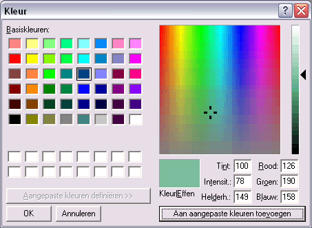



## CommonColorDialog custom colors

### Description

Remember the custom defined colors for the common_color_dialog.
 
### More Info
 
A better memory as the regular dialog

             |
---                |---
**Submitted On**   |2002-03-19 14:41:20
**By**             |[Richard\_W](https://github.com/Planet-Source-Code/PSCIndex/blob/master/ByAuthor/richard-w.md)
**Level**          |Beginner
**User Rating**    |4.3 (13 globes from 3 users)
**Compatibility**  |VB 6\.0
**Category**       |[Custom Controls/ Forms/  Menus](https://github.com/Planet-Source-Code/PSCIndex/blob/master/ByCategory/custom-controls-forms-menus__1-4.md)
**World**          |[Visual Basic](https://github.com/Planet-Source-Code/PSCIndex/blob/master/ByWorld/visual-basic.md)
**Archive File**   |[CommonColo633983192002\.zip](https://github.com/Planet-Source-Code/richard-w-commoncolordialog-custom-colors__1-32823/archive/master.zip)

